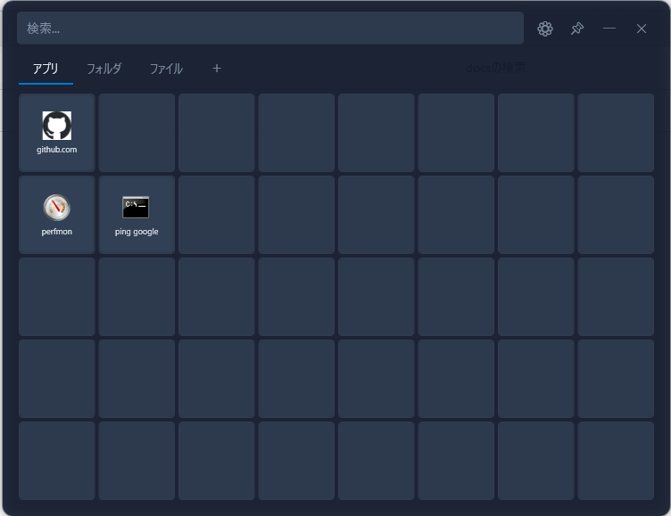
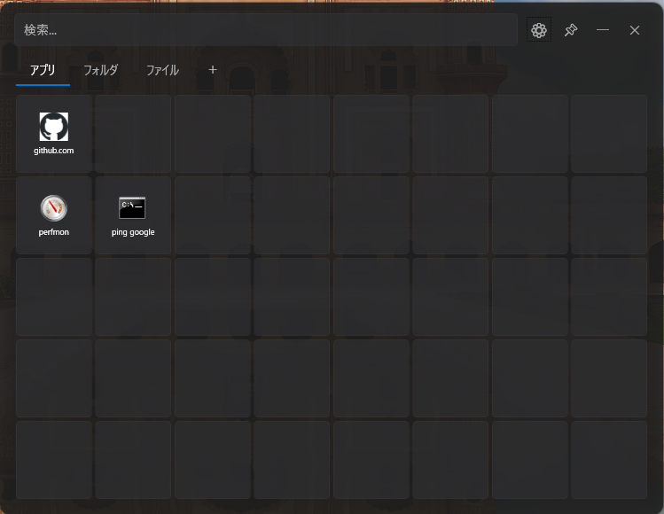
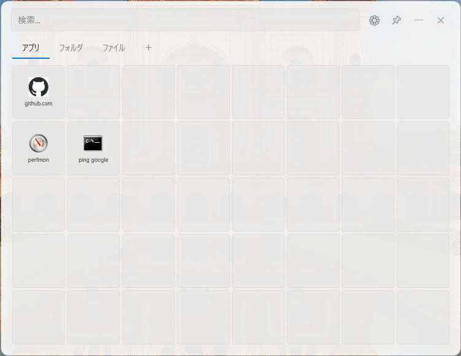
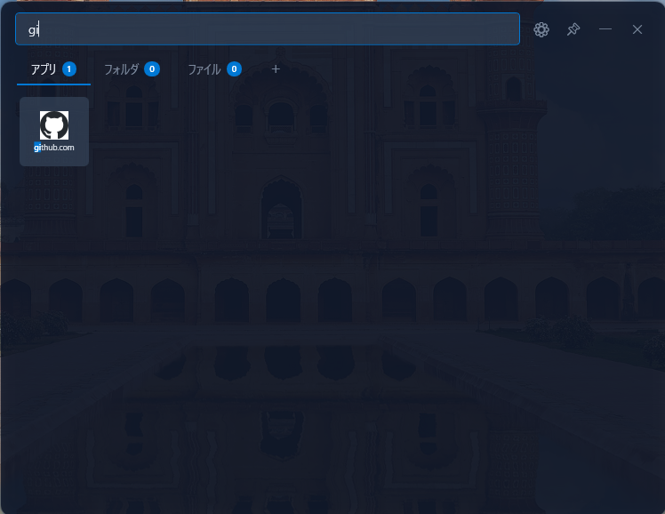
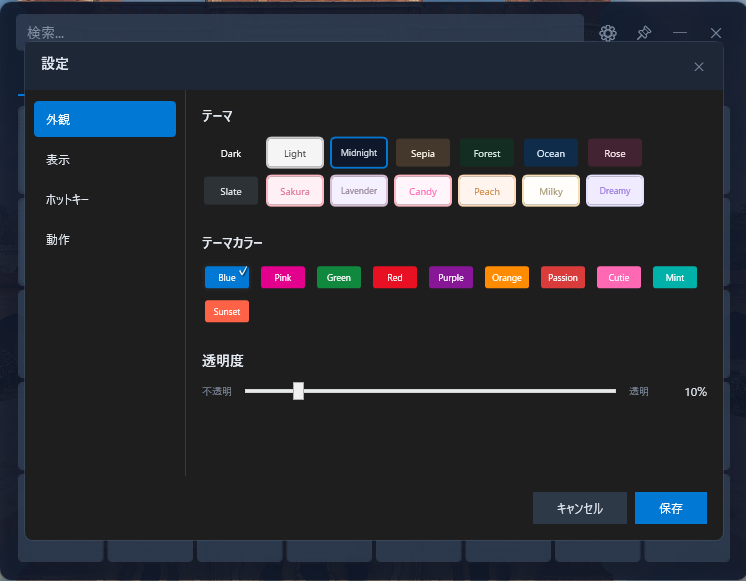
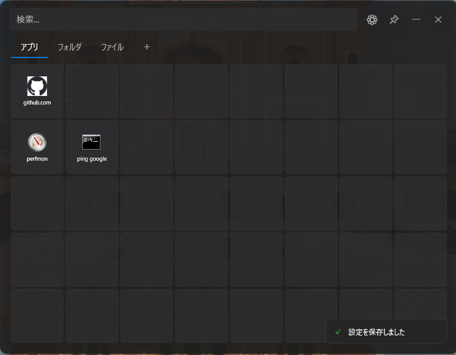

# DesktopLauncher

Windows用のデスクトップランチャーアプリケーション

## スクリーンショット

### メイン画面


### ダークテーマ / ライトテーマ
| ダーク | ライト |
|--------|--------|
|  |  |

### 検索機能


### 設定画面


### トースト通知


## 概要

DesktopLauncherは、アプリケーション、ファイル、フォルダ、URLをグリッド形式で管理・起動できるランチャーアプリです。グローバルホットキーで素早く呼び出し、検索機能で目的のアイテムに即座にアクセスできます。

## 動作環境

- **OS:** Windows 10 / 11
- **フレームワーク:** .NET Framework 4.8
- **アーキテクチャ:** x64 / x86

## 機能一覧

### 基本機能

| 機能 | 説明 |
|------|------|
| アイテム登録 | アプリ、ファイル、フォルダ、URLを登録可能 |
| グリッド表示 | タイル形式でアイテムを配置・管理 |
| カテゴリ管理 | タブ形式でアイテムをカテゴリ分け |
| 検索機能 | インクリメンタルサーチでアイテムを絞り込み |
| ドラッグ&ドロップ | ファイル/URLのドロップで簡単登録 |
| グローバルホットキー | どの画面からでもランチャーを呼び出し |
| トースト通知 | 操作完了時に右下に通知表示 |

### アイテム操作

| 操作 | 方法 |
|------|------|
| 追加 | ドラッグ&ドロップ / 右クリックメニュー |
| URL追加 | 右クリック → URL追加（直接入力） |
| 編集 | アイテムを右クリック → 編集 |
| 削除 | アイテムを右クリック → 削除 |
| 移動 | タイルをドラッグして並べ替え |
| カテゴリ移動 | タイルをタブにドラッグ |
| 管理者として実行 | 右クリック → 管理者として実行 |
| ファイルの場所を開く | 右クリック → ファイルの場所を開く |

### カテゴリ操作

| 操作 | 方法 |
|------|------|
| 追加 | +ボタンをクリック |
| 編集 | タブをダブルクリック |
| 削除 | タブを右クリック → 削除 |
| 並べ替え | タブをドラッグして順序変更 |

## 設定項目

### 外観設定

#### テーマ（14種類）

| ダーク系 | ライト系 |
|---------|---------|
| Dark | Light |
| Midnight（深い青黒） | Sakura（桜ピンク） |
| Sepia（暖かい茶系） | Lavender（やさしい紫） |
| Forest（深緑） | Candy（パステル） |
| Ocean（海の青） | Peach（オレンジピンク） |
| Rose（ローズピンク） | Milky（クリーム） |
| Slate（グレー） | Dreamy（夢かわいい） |

#### アクセントカラー（10種類）

Blue / Pink / Green / Red / Purple / Orange / Passion / Cutie / Mint / Sunset

#### タイルサイズ

| サイズ | グリッド | 総スロット数 |
|--------|---------|-------------|
| Small | 10列 × 6行 | 60 |
| Medium | 8列 × 5行 | 40 |
| Large | 6列 × 4行 | 24 |

タイルサイズに応じてアイコンとテキストのサイズも自動調整されます。

#### ウィンドウ透明度

0%（不透明）〜 70%（透明）の範囲で調整可能

※設定画面・編集画面などのダイアログは常に不透明で表示

### 動作設定

| 設定 | デフォルト | 説明 |
|------|-----------|------|
| ホットキー | Alt + Space | ランチャー呼び出しキー |
| Windows起動時に自動起動 | OFF | スタートアップ登録 |
| 起動時に最小化 | ON | バックグラウンド起動 |
| アイテム起動後に隠す | ON | 起動後にウィンドウを非表示 |

## キーボードショートカット

| キー | 動作 |
|------|------|
| Alt + Space | ランチャーの表示/非表示（デフォルト） |
| Escape | ウィンドウを隠す |
| Enter | 検索結果の最初のアイテムを起動 |
| 文字入力 | 検索ボックスにフォーカス＆検索開始 |

## 登録可能なアイテムタイプ

| タイプ | 説明 | アイコン |
|--------|------|---------|
| Application | 実行ファイル（.exe） | ファイルから自動取得 |
| File | 各種ファイル | 関連付けアプリから取得 |
| Folder | フォルダ | システムフォルダアイコン |
| URL | Webサイト | サイトのファビコンを自動取得 |

## アイテムの詳細設定

| 項目 | 説明 |
|------|------|
| 名前 | 表示名（自動検出または手動設定） |
| パス | ファイルパスまたはURL |
| 引数 | 起動時のコマンドライン引数 |
| 作業ディレクトリ | 実行時のカレントディレクトリ |
| カスタムアイコン | 任意のアイコン画像（.ico, .png, .jpg） |

## コマンド登録例

コマンドプロンプトやPowerShellのコマンドも登録できます。

### コマンドプロンプト

| 用途 | パス | 引数 |
|------|------|------|
| ping実行 | `cmd.exe` | `/k ping google.com` |
| ipconfig確認 | `cmd.exe` | `/k ipconfig /all` |
| CPU使用率監視 | `cmd.exe` | `/k typeperf "\Processor(_Total)\% Processor Time"` |
| 特定フォルダで開く | `cmd.exe` | `/k cd /d C:\Projects` |

※ `/k` はコマンド実行後ウィンドウを開いたまま、`/c` は閉じる

### PowerShell

| 用途 | パス | 引数 |
|------|------|------|
| コマンド実行 | `powershell.exe` | `-NoExit -Command "Get-Process"` |
| 上位プロセス表示 | `powershell.exe` | `-NoExit -Command "Get-Process \| Sort CPU -Desc \| Select -First 10"` |

### システムツール

| 用途 | パス |
|------|------|
| タスクマネージャー | `taskmgr.exe` |
| リソースモニター | `resmon.exe` |
| パフォーマンスモニター | `perfmon.exe` |
| システム情報 | `msinfo32.exe` |

## データ保存

### 保存場所

```
%LOCALAPPDATA%\DesktopLauncher\launcher_data.json
```

### ファビコンキャッシュ

```
%LOCALAPPDATA%\DesktopLauncher\Icons\
```

URL登録時に取得したファビコンはこのフォルダにキャッシュされます。

### 保存内容

- アプリケーション設定
- カテゴリ一覧
- 登録アイテム一覧

### バックアップ

上記のJSONファイルをコピーすることでバックアップ可能。
別PCへの移行時もこのファイルをコピーすれば設定を引き継げます。

## ビルド方法

### 必要環境

- Visual Studio 2022 以降
- .NET Framework 4.8 SDK

### ビルド手順

```bash
cd DesktopLauncher
dotnet build -c Release
```

### 出力先

```
DesktopLauncher\bin\Release\net48\DesktopLauncher.exe
```

## プロジェクト構成

```
DesktopLauncher/
├── Infrastructure/          # インフラ層
│   ├── Controls/           # カスタムコントロール
│   ├── Converters/         # 値コンバーター
│   ├── DependencyInjection/# DIコンテナ設定
│   └── Helpers/            # ヘルパークラス
├── Interfaces/              # インターフェース定義
│   ├── Repositories/       # リポジトリIF
│   └── Services/           # サービスIF
├── Models/                  # データモデル
│   └── Enums/              # 列挙型
├── Repositories/            # データ永続化
├── Services/                # ビジネスロジック
├── ViewModels/              # MVVM ViewModel
├── Views/                   # 画面定義（XAML）
│   └── Themes/             # テーマリソース
├── App.xaml                 # アプリケーション定義
└── MainWindow.xaml          # メインウィンドウ
```

## 使用ライブラリ

| ライブラリ | バージョン | 用途 |
|-----------|-----------|------|
| CommunityToolkit.Mvvm | 8.2.2 | MVVMフレームワーク |
| Microsoft.Extensions.DependencyInjection | 8.0.0 | DIコンテナ |
| Newtonsoft.Json | 13.0.3 | JSON シリアライズ |
| FuzzySharp | 2.0.2 | あいまい検索 |

## ライセンス

MIT License

## 作者

[smit]
