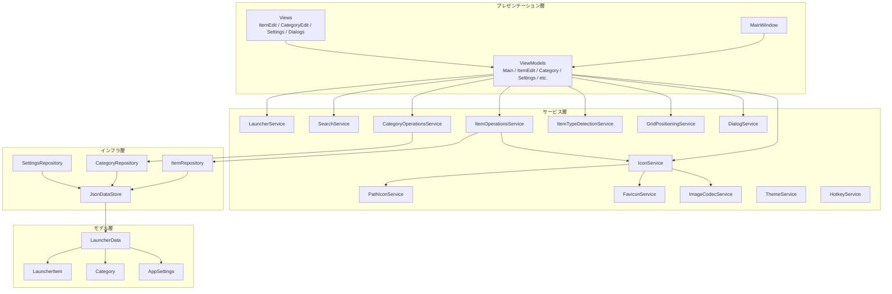

# アーキテクチャ概要

## ソリューション構成

- **プロジェクト:** 単一プロジェクト構成（`DesktopLauncher`）
- **フレームワーク:** .NET Framework 4.8 (WPF + WinForms参照)
- **言語:** C# (latest, Nullable有効)
- **パターン:** MVVM + Service Locator + Repository

### 主要NuGetパッケージ

| パッケージ | 用途 |
|---|---|
| CommunityToolkit.Mvvm | MVVMパターン支援（ObservableProperty, RelayCommand等） |
| Microsoft.Extensions.DependencyInjection | DIコンテナ |
| Newtonsoft.Json | JSONシリアライズ |
| FuzzySharp | あいまい検索 |

---

## レイヤー構成

```
┌─────────────────────────────────────────────────┐
│  プレゼンテーション層                              │
│  Views (XAML) ← バインディング → ViewModels        │
├─────────────────────────────────────────────────┤
│  サービス層                                       │
│  IconService / SearchService / LauncherService 等  │
├─────────────────────────────────────────────────┤
│  インフラ層                                       │
│  Repositories → JsonDataStore → launcher_data.json │
├─────────────────────────────────────────────────┤
│  モデル層                                         │
│  LauncherItem / Category / AppSettings             │
└─────────────────────────────────────────────────┘
```

---

## プレゼンテーション層

### Views（XAML）

| ファイル | 役割 |
|---|---|
| `MainWindow.xaml` | メインウィンドウ（グリッド表示・検索・カテゴリタブ） |
| `Views/ItemEditWindow.xaml` | アイテム編集ダイアログ |
| `Views/CategoryEditWindow.xaml` | カテゴリ編集ダイアログ |
| `Views/SettingsWindow.xaml` | 設定画面 |
| `Views/ConfirmDialog.xaml` | 確認ダイアログ |
| `Views/InputDialog.xaml` | 入力ダイアログ |
| `Views/MessageDialog.xaml` | メッセージダイアログ |

### テーマ・スタイル

| ファイル | 役割 |
|---|---|
| `Views/Themes/DarkTheme.xaml` | ダークテーマリソース |
| `Views/Themes/LightTheme.xaml` | ライトテーマリソース |
| `Views/Styles/CommonStyles.xaml` | 共通スタイル定義 |

### ViewModels

| クラス | 役割 |
|---|---|
| `MainViewModel` | メイン画面の状態管理（カテゴリ・アイテム・検索・グリッド） |
| `ItemEditViewModel` | アイテム編集画面のロジック |
| `CategoryViewModel` | カテゴリ1件分の表示用ViewModel |
| `SettingsViewModel` | 設定画面のロジック |
| `LauncherItemViewModel` | アイテム1件分の表示用ViewModel |
| `GridSlotViewModel` | グリッドの1スロット分（空 or アイテム配置） |
| `ToastViewModel` | トースト通知の表示用ViewModel |
| `ViewModelBase` | ViewModel基底クラス |

### Infrastructure（UI基盤）

| クラス | 役割 |
|---|---|
| `HighlightTextBlock` | 検索キーワードのハイライト表示用カスタムコントロール |
| `DragDropHelper` | ドラッグ＆ドロップ操作のヘルパー |
| `HotkeyFormatter` | ホットキー表示文字列のフォーマッター |
| 各種Converter | WPFバインディング用コンバーター（Bool→Visibility, Enum変換等） |

---

## サービス層

### アイコン関連（3層分離構成）

`IconService` が統合窓口として機能し、内部で3つの専門サービスに委譲する。

```
IIconService (IconService)
├── IPathIconService (PathIconService)    … ファイル/フォルダパスからアイコン抽出
├── IFaviconService (FaviconService)      … URLからファビコン取得
└── IImageCodecService (ImageCodecService) … 画像のBase64変換・コーデック処理
```

### その他サービス

| インターフェース | 実装クラス | 責務 |
|---|---|---|
| `ILauncherService` | `LauncherService` | アイテムの起動・ファイル位置表示 |
| `ISearchService` | `SearchService` | 部分一致検索（スペース区切りOR検索） |
| `IItemOperationsService` | `ItemOperationsService` | アイテムのCRUD操作 |
| `ICategoryOperationsService` | `CategoryOperationsService` | カテゴリのCRUD操作 |
| `IItemTypeDetectionService` | `ItemTypeDetectionService` | パスからアイテム種別を自動判定 |
| `IGridPositioningService` | `GridPositioningService` | グリッドレイアウトの配置計算 |
| `IThemeService` | `ThemeService` | テーマ/アクセントカラーの切替 |
| `IHotkeyService` | `HotkeyService` | グローバルホットキーの登録・解除 |
| `IStartupService` | `StartupService` | Windows起動時の自動起動設定 |
| `IDialogService` | `DialogService` | ダイアログ表示の抽象化 |
| — | `UrlHelper` | URL判定ユーティリティ |

---

## インフラ層（データ永続化）

### JsonDataStore

単一のJSONファイル（`%LOCALAPPDATA%\DesktopLauncher\launcher_data.json`）で全データを永続化する。

- スレッドセーフなアクセス（`lock`による排他制御）
- 書き込み時はテンポラリファイル→リネームによるアトミック更新
- バックアップファイルの自動作成

### リポジトリ

すべて `IRepository<T>` を基底とした汎用CRUDインターフェースを実装。

| インターフェース | 実装クラス | 対象モデル |
|---|---|---|
| `IItemRepository` | `ItemRepository` | `LauncherItem` |
| `ICategoryRepository` | `CategoryRepository` | `Category` |
| `ISettingsRepository` | `SettingsRepository` | `AppSettings` |

`IItemRepository` と `ICategoryRepository` は `IRepository<T>` を拡張し、カテゴリ別取得や並び順更新などの専用メソッドを持つ。

---

## モデル層

| クラス | 概要 |
|---|---|
| `LauncherItem` | ランチャーアイテム（Id, Name, Path, ItemType, CategoryId, IconBase64, GridPosition 等） |
| `Category` | カテゴリ（Id, Name, SortOrder, Icon） |
| `AppSettings` | アプリ設定（ホットキー, テーマ, ウィンドウ透明度, タイルサイズ等） |
| `LauncherData` | JSON永続化のルートオブジェクト（Categories + Items + Settings） |

### 列挙型

| Enum | 値 |
|---|---|
| `ItemType` | Application, File, Folder, URL |
| `Theme` | Dark, Light, Midnight, Sakura 等（14種類） |
| `ThemeColor` | Blue, Pink, Green 等（10種類） |
| `TileSize` | Small, Medium, Large |
| `ViewMode` | 表示モード |

---

## DI構成

`ServiceLocator.Initialize()` で全サービスをシングルトン登録。`MainViewModel` のみ Transient。

```
App.Application_Startup()
  → ServiceLocator.Initialize()    // DIコンテナ構築
  → テーマ適用
  → MainWindow表示
```

---

## 依存関係図



---

## 主要な処理フロー

### アプリ起動

```
App.Application_Startup
  → シングルインスタンスチェック（Mutex）
  → ServiceLocator.Initialize()（DIコンテナ構築）
  → テーマ・カラー・透明度を適用
  → MainWindow 表示
```

### アイテム検索

```
SearchText変更
  → MainViewModel.OnSearchTextChanged()
  → FilterItems()
    → 全カテゴリに対して SearchService.Search() でマッチ数算出
    → FilteredCategories をマッチ数降順で更新
    → 選択カテゴリのアイテムをスコア順に DisplayedItems へ
    → SearchGridSlots を先頭詰めで生成
```

### アイテム起動

```
タイルクリック / Enter
  → MainViewModel → LauncherService.Launch(item)
  → Process.Start() で対象を起動
  → 設定に応じてウィンドウを非表示
```
