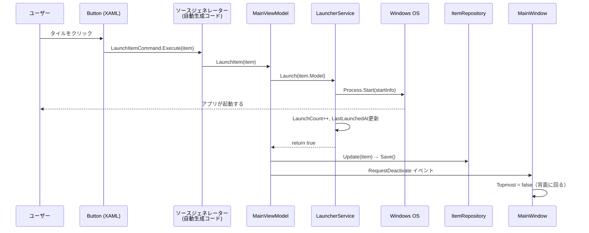

# UIからアイテム起動までの処理フロー

ユーザーがタイルをクリックしてからアプリが起動するまでの全ステップを解説する。

## 処理フロー概要

```
タイルクリック → WPFコマンド → ViewModel → Service → Process.Start → ウィンドウ背面化
```

---

## ステップ1: XAML — ボタンにコマンドがバインドされている

`MainWindow.xaml`
```xml
<Button Command="{Binding DataContext.LaunchItemCommand, 
                          RelativeSource={RelativeSource AncestorType=Window}}"
        CommandParameter="{Binding Item}">
```

- `Button` をクリックすると、WPFが `Command` に設定された `ICommand.Execute()` を呼ぶ
- **`LaunchItemCommand`** は `MainViewModel` のプロパティ
- **`Item`** は `GridSlotViewModel.Item`（クリックしたタイルのアイテム）

> ポイント: `LaunchItemCommand` というプロパティは自分で書いていない。次のステップで説明。

---

## ステップ2: ソースジェネレーター — コマンドが自動生成される

`MainViewModel.cs`
```csharp
[RelayCommand]                           // ← この属性が鍵
private void LaunchItem(LauncherItemViewModel? item)
```

`[RelayCommand]` を付けると、ビルド時にソースジェネレーターが**見えないコード**を自動生成する：

```csharp
// 自動生成（実際のファイルには書かれていない）
public IRelayCommand<LauncherItemViewModel?> LaunchItemCommand { get; }

// 内部で LaunchItem(item) を呼ぶ
LaunchItemCommand = new RelayCommand<LauncherItemViewModel?>(LaunchItem);
```

XAMLの `Command="{Binding LaunchItemCommand}"` → ボタンクリック → `LaunchItem(item)` メソッドが呼ばれる。

---

## ステップ3: MainViewModel — サービスに起動を委譲

`MainViewModel.cs`
```csharp
private void LaunchItem(LauncherItemViewModel? item)
{
    if (item == null) return;

    var success = _launcherService.Launch(item.Model);  // ← サービスに委譲
    if (success)
    {
        _itemRepository.Update(item.Model);     // 起動回数を保存
        _itemRepository.Save();
        RequestDeactivate?.Invoke(this, EventArgs.Empty);  // ← Viewにウィンドウ非表示を要求
    }
    else
    {
        _dialogService.ShowError($"'{item.Name}' の起動に失敗しました。");
    }
}
```

- `item.Model` で `LauncherItemViewModel` → `LauncherItem`（純粋なデータ）に変換
- `_launcherService` はコンストラクタインジェクションで受け取った `ILauncherService`
- 実体は `LauncherService`（`ServiceLocator` で登録済み）

---

## ステップ4: LauncherService — 実際にプロセスを起動

`LauncherService.cs`
```csharp
public bool Launch(LauncherItem item, bool runAsAdmin = false)
{
    var startInfo = new ProcessStartInfo
    {
        FileName = item.Path,           // 例: "C:\Program Files\chrome.exe"
        UseShellExecute = true
    };

    if (!string.IsNullOrEmpty(item.Arguments))
        startInfo.Arguments = item.Arguments;        // 例: "--new-window"

    if (item.ItemType != ItemType.Url)
        startInfo.WorkingDirectory = ...;            // 作業ディレクトリ設定

    if (runAsAdmin)
        startInfo.Verb = "runas";                    // 管理者権限

    Process.Start(startInfo);                        // ★ ここで実際に起動

    item.LaunchCount++;                              // 起動回数+1
    item.LastLaunchedAt = DateTime.Now;              // 最終起動時刻記録

    return true;
}
```

---

## ステップ5: MainWindow — ウィンドウを背面に

`MainWindow.xaml.cs`
```csharp
private void OnRequestDeactivate(object? sender, EventArgs e)
{
    Dispatcher.Invoke(() =>
    {
        Topmost = false;              // 最前面を解除
    });
}
```

- ステップ3で `RequestDeactivate` イベントが発火
- `MainWindow` がこのイベントを購読しており、ウィンドウを背面に回す

---

## シーケンス図



---

## 各層の役割

| 層 | 何をしているか | ファイル |
|---|---|---|
| **View (XAML)** | ボタンにコマンドをバインドするだけ。ロジックは一切書かない | `MainWindow.xaml` |
| **ソースジェネレーター** | `[RelayCommand]` から `ICommand` を自動生成。XAMLとViewModelを繋ぐ | (自動生成) |
| **ViewModel** | 起動の成否に応じてUI更新・データ保存を判断する **司令塔** | `MainViewModel.cs` |
| **Service** | 実際の起動処理（`Process.Start`）。UIを知らない | `LauncherService.cs` |
| **Repository** | 起動回数をJSONに永続化 | `ItemRepository.cs` |
| **View (コードビハインド)** | ViewModelからのイベントでウィンドウ操作のみ | `MainWindow.xaml.cs` |

この構成により、ViewModel・Service・Repository はUIに依存しないため、テストや変更が容易になっている。
